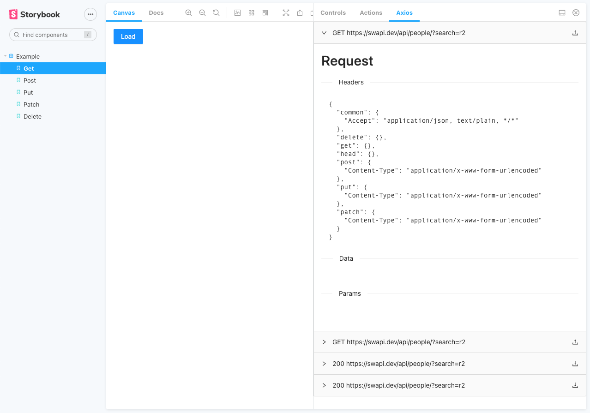
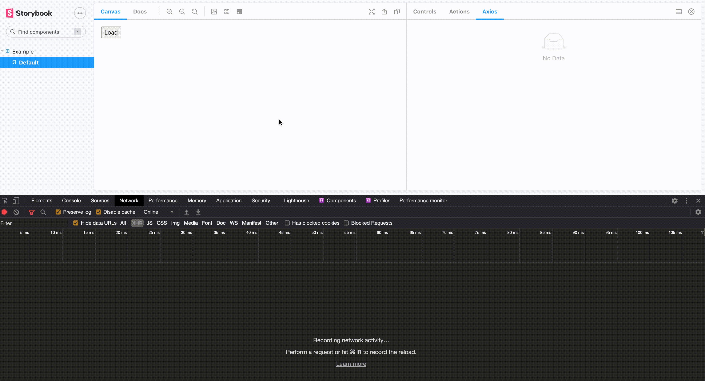

# storybook-axios
Storybook addon to inspect axios network requests.



## Demo
[Check out the demo](https://faebeee.github.io/storybook-axios/index.html)

## Tech
Created using [React](https://www.npmjs.com/package/react), [axios](https://www.npmjs.com/package/axios) and [antd](https://www.npmjs.com/package/antd)

## Installation

`npm install storybook-axios`
   

## Configure

Add addon  "storybook-axios" in `.storybook/main.js`

```js
module.exports = {
    stories: [
        '../srcv2/**/*.stories.mdx',
        '../srcv2/**/*.stories.@(js|jsx|ts|tsx)',
    ],
    addons: [
        '@storybook/addon-essentials',
        '@storybook/addon-notes/register',
        '@storybook/addon-a11y',
        '@whitespace/storybook-addon-html',
        'storybook-axios'
    ],

```

add a decorator in `.storybook/preview.js` and pass in the `axios` instance which is used in your app.

```js
import withAxiosDecorator from 'storybook-axios';
import { getAxios } from '../utils/get-axios';

export const parameters = {
    actions: { argTypesRegex: "^on[A-Z].*" },
}

export const decorators = [withAxiosDecorator(getAxios())];

```

__Note__ best way is to have an axios helper library, which creates a single instance and reuses it everywhere in the app.
The decorator adds interceptors to that axios instance in order to listen for network requests.


## Example

