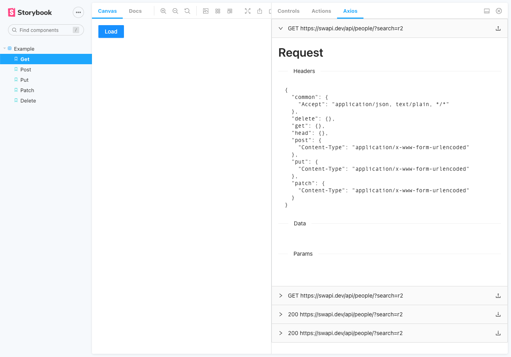
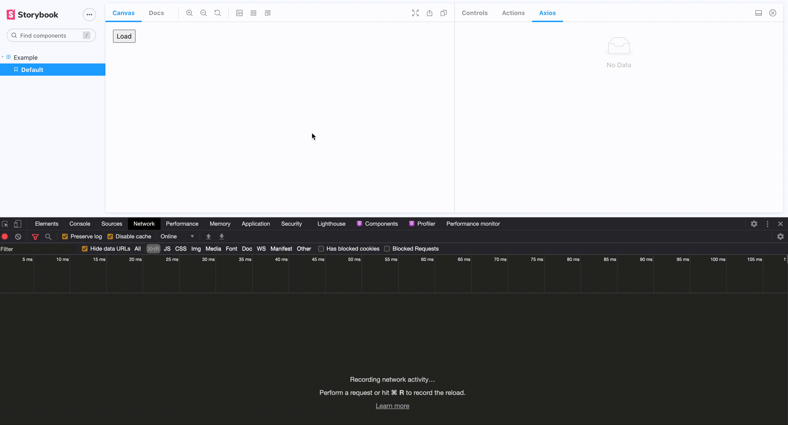

# storybook-axios


Storybook addon to inspect axios network requests.



## Demo
[Check out the demo](https://faebeee.github.io/storybook-axios/index.html)

## Tech
Created using [React](https://www.npmjs.com/package/react), [axios](https://www.npmjs.com/package/axios) and [antd](https://www.npmjs.com/package/antd)

## Installation

`npm install storybook-axios`
   

## Configure

Add addon  "storybook-axios" in `.storybook/main.ts`

```js
module.exports = {
    ...
    addons: [
        ...
        'storybook-axios/manager'
    ],
```

add a decorator in `.storybook/preview.ts` and pass in the `axios` instance which is used in your app.

```js
import withAxiosDecorator from 'storybook-axios';
import { getAxios } from '../utils/get-axios';

export const parameters = {
    actions: { argTypesRegex: "^on[A-Z].*" },
}

export const decorators = [withAxiosDecorator(getAxios())];

```

__Note__ best way is to have an axios helper library, which creates a single instance and reuses it everywhere in the app.
The decorator adds interceptors to that axios instance in order to listen for network requests.


## Mock
To mock several request, you can configure a mock function. This is best done on a per-story base

```tsx
// Button.stories.tsx
export default {
  title: 'Button',
  component: Buttoon, 
  tags: ['autodocs'],
  decorators: [withStorybookAxios(getAxios(), {
    mock: mock => {
      mock.onGet('/my-api-request').reply(404);
    }
  })]
} as Meta<typeof TextSurveyContentPdfView>;

```

for more detailed configuration of the mock [checkout these docs](https://www.npmjs.com/package/axios-mock-adapter)

## Example


